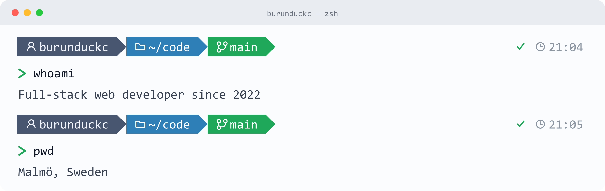

<picture>
  <source media="(prefers-color-scheme: dark)" srcset="banner-dark.png">
  
</picture>

## About me

- 💻 Full-stack web developer since 2022
- 📍 Malmö, Sweden

## Tech Stack

<table>
<tr>
  <td><b>Frontend</b></td>
  <td></td>
  <td></td>
  <td></td>
  <td></td>
  <td></td>
  <td></td>
</tr>
<tr>
  <td><b>Backend</b></td>
  <td></td>
  <td></td>
  <td></td>
  <td></td>
</tr>
<tr>
  <td><b>Data</b></td>
  <td></td>
  <td></td>
  <td></td>
</tr>
<tr>
  <td><b>Deploy</b></td>
  <td></td>
  <td></td>
  <td></td>
</tr>
<tr>
  <td><b>Tools</b></td>
  <td></td>
  <td></td>
  <td></td>
  <td></td>
</tr>
</table>
